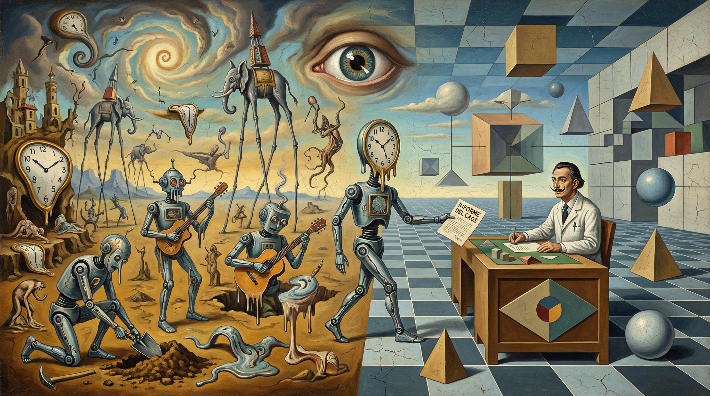

# Vibe Research

[[中文]](./README.cn.md)

Right now, the hottest topic in the developer community is "Vibe Coding." It’s the idea that we can stop worrying about every single line of code and instead act more like managers or product owners, letting AI handle the heavy lifting. It has massively boosted engineering efficiency. As researchers, we can't help but ask: **can we use "Vibe Research" to speed up the process of scientific discovery?**

Most people’s first reaction is resistance—and for good reason. The word "vibe" suggests a certain sloppiness. We’ve been trained to believe that research must be precise, rigorous, and verifiable at every step. AI-generated code, by contrast, is often unreliable and acts like an unexplainable black box. This lack of reliability and interpretability is a headache in software engineering, so it feels even more out of place in the "sacred halls" of science, where there is zero room for error.

To resolve this conflict, we need to look closer at what research actually is and define the boundaries of where "vibes" belong.

## The Context of Discovery vs. The Context of Justification

To understand why Vibe Research is legitimate, we can look to the philosopher of science Hans Reichenbach. He distinguished between two stages: the **Context of Discovery** and the **Context of Justification**.

The "Context of Discovery" is that chaotic moment when a new idea is born—it’s driven by intuition, gut feelings, and non-linear leaps. The "Context of Justification" is the cold, hard phase that follows, where you use logic and experiments to test that idea. We often make the mistake of applying the harsh standards of "justification" too early, which kills creativity before it even has a chance to breathe.

If we look at the scientific ecosystem as a whole, this discovery process is what Dashun Wang’s team at Northwestern University calls "treasure hunting on a beach." Their data shows a clear trend: AI is the ultimate accelerator for this process. It can turn mediocre ideas into something solid and give good ideas even more depth (*The Philosopher’s Stone for Science*).

In the "Context of Discovery," our goal is to use this acceleration to dig as fast as possible. When you’re facing a vast, uneven beach, you need sharp insight paired with lightning-fast verification. As Chen-Ning Yang once said about Edward Teller: Teller had ten ideas a day. Nine and a half of them were wrong. But as long as half an idea was right, his total contribution over time was immeasurable. For creative researchers, the bottleneck isn't a lack of ideas—it’s how quickly you can test them before the inspiration fades.

Vibe Research is built to break this bottleneck. It lives entirely within the "Context of Discovery." It doesn’t aim to produce a perfect paper on the first try; it’s happy being a messy but efficient "scratchpad." Unlike Vibe Coding, which produces a final product for a user, Vibe Research produces intermediate results to verify an insight. Once we accept it as a scratchpad, we can let go of the need for perfection and use AI to perform massive, low-cost "probes" across the scientific landscape.

## Information Bottlenecks and Interpretability

Even if it’s just a scratchpad, we can’t let it be a total mess. For the work to be valuable, we have to solve two connected problems: **trust and understanding.**

If you don’t understand what an AI Agent actually did, you can’t trust the result. AI code often follows non-human logic—but honestly, even code written by a human colleague without documentation can be impossible to parse.

To fix this, we need a change in perspective: **Don't treat the AI Agent as a tool. Treat it as a "talented but untrustworthy remote research team."**

In this model, Vibe Research is like outsourcing part of your exploration to a remote lab. This team works incredibly fast and helps you fail quickly, but their style is weird, and they might even "hallucinate" to save time. In a real-world collaboration, how would you manage a team like that? You wouldn't just accept a bunch of scattered data or messy scripts. You’d demand standardized deliverables: a report explaining their logic (a paper), a manual so others can reproduce it (a README), and detailed experiment records (a Log).

This brings us back to the "Information Bottleneck" theory in machine learning. Since we can’t (and don’t want to) monitor every single line of code, we need a highly compressed "interface" for information exchange. In science, the "paper" is the most efficient information bottleneck we have for communicating between researchers.

Therefore, the core of Vibe Research is simply replicating this proven scientific collaboration mechanism: building a human-readable documentation system that acts as the contract and interface between you and the "external team" (the AI Agent).

## The Vibe Research Workflow

To build a trustworthy "information bottleneck," we need a structured set of documents. These aren't just records; they are the bridge between human thought and AI execution.

### 1. Theoretical Mapping: `paper.md`

This is a "shadow paper." It’s not meant for publication, but it must follow academic standards. The principle here is **"Theory over Implementation."** It acts as a lens to see through the AI’s complex code. The "Method" section must ignore specific class names or function calls and focus on mathematical principles and algorithmic frameworks. The "Result" section should show clear charts and data analysis. You are reviewing the scientific thought, not the engineering chores.

### 2. Engineering Guide: `README.md`

A standard engineering manual focused on **"Reproducibility."** It explains the architecture of the code and how to run it, ensuring that anyone (or your future self) can quickly understand the project structure and data organization. It doesn't care about the math; it only cares about making the code run.

### 3. The Experimental Black Box: `log.md`

An append-only journal following the **"Traceability"** principle. Every parameter, process, result, and even the Agent’s "thought process" must be recorded. It focuses on *differences*—what changed since the last run and why? This keeps the "human-in-the-loop," ensuring every step of the experiment's evolution can be traced back.

### The Core Mechanism: Bi-directional Sync

The soul of this system is "Code-Doc Synchronization." It’s a mandatory two-way constraint: if the Agent changes the code, it must update the math in the docs. If you correct a formula in the docs, it must be synced back to the code. This ensures the documentation is always a high-fidelity "compression" of what’s happening under the hood.

## Code Principles for Research

High-level docs aren't enough; we also need specific rules for the code itself. In industry, people love "Clean Code"—heavy abstraction, encapsulation, and reuse. In research, this usually backfires. To keep research code readable, I suggest telling your Agent to follow these principles in `agents.md`:

First, **KISS (Keep It Simple, Stupid)** and **YAGNI (You Ain't Gonna Need It)**. In the discovery phase, you don't need interfaces for future features or generic utility classes. If code exists only to test a current hypothesis, write it in the most direct way possible. Over-engineering just wastes AI cycles and makes it harder for you to read.

Second, and most importantly: **LoB (Locality of Behavior)**. In modern software engineering, logic is often split across dozens of files and layers of inheritance. This is a disaster for research. You shouldn't have to jump between ten files to understand one logical chain. We want code that mirrors the linear push of a mathematical derivation. If a function is 60 lines long but clearly shows the steps of a formula, it’s "good code." "Journal-style" code might be frowned upon in engineering, but in science, it lets you see the algorithm for what it is.

Finally, we need **Fail Fast**. Commercial software needs to stay alive even if it hits an error; research code needs to be incredibly sensitive. If a data dimension is wrong or a variable hits a "NaN," the program should crash immediately. Crashing is the most useful form of debugging information.

## The Boundaries of Vibe Research

I want to emphasize the boundary: this process only works in the **Context of Discovery**.

The moment your hypothesis is verified through Vibe Research and you prepare to write a formal paper—moving into the **Context of Justification**—the "vibe" must end. At this stage, everything must return to the human. You should use your `paper.md` as a guide and manually (or under very tight supervision) reproduce every result. Since the core ideas and derivations were yours to begin with, this reproduction is what ensures the "treasure map" you found on the scratchpad is actually solid scientific knowledge.

# Appendix

[AGENTS.md](./AGENTS.md)